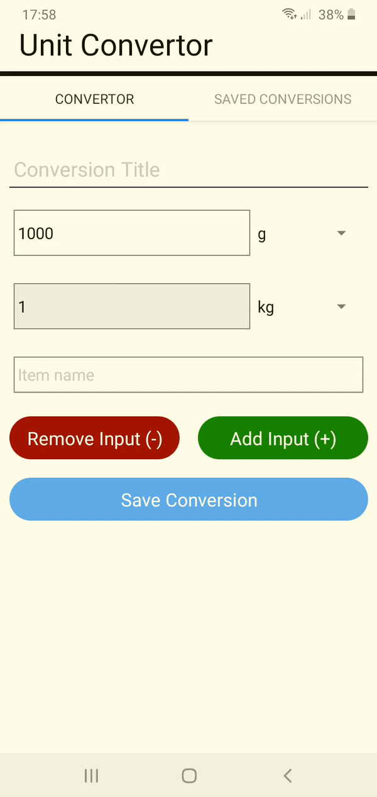

# maze-geneneration

A react-native app used to convert between various mass and volume units. Built with Android in mind.

## Contributing

Please view our [CONTRIBUTING.md](https://github.com/JRIngram/UnitConvertApp/blob/develop/CONTRIBUTING.md) file for information on how to contribute, report issues and request features.

## Changelog and versioning

Please view our [CHANGELOG.md](https://github.com/JRIngram/UnitConvertApp/blob/develop/CHANGELOG.md) file for information on our updates.

We use [SemVer](http://semver.org/) for versioning.

### Installing (for development)

#### Prerequisites

1. Ensure Node is installed on your machine
2. Ensure the expo app is installed on your mobile device
3. Follow the steps from the official [react native website](https://reactnative.dev/docs/environment-setup) to set-up expo CLI.
4. Run `npm start`
